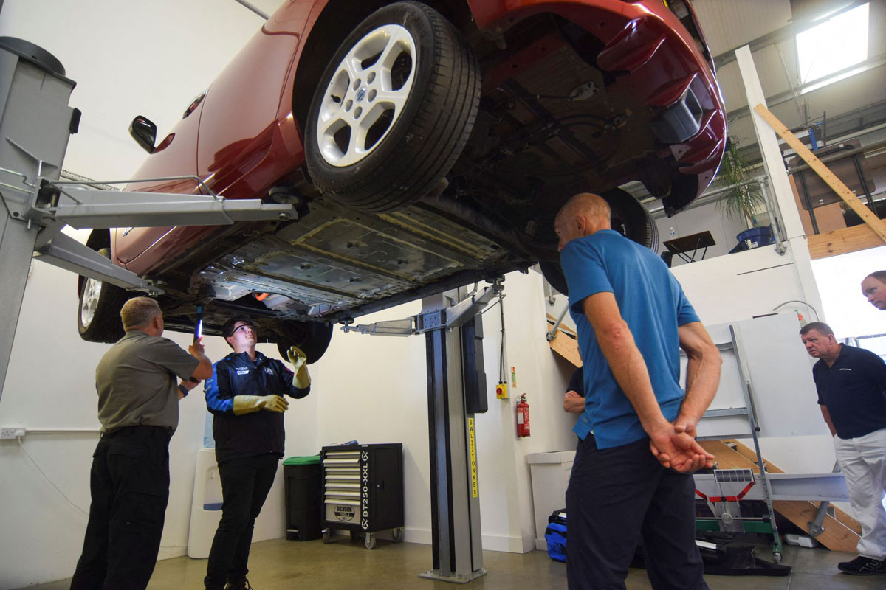

# 전기자동차와의 비교
[문제 생기면 더 골치... 전기차, 수리하려면 더 비싸고 오래 기다려](https://www.autoview.co.kr/news/articleView.html?idxno=81458)

  

&rarr; 위처럼 정비 인력 및 장비의 부족으로 아직까지는 전기차의 수리 비용과 기간이 더 불리함.  
&rarr; 따라서 UAM 정비 산업에 대한 정부의 전폭적인 지원이 가능한, __대중교통의 형식__ 으로 상용화 되어야 규모의 경제를 이룰 수 있음.

 

#### 정비 문제에 따라 기체 각각의 형상이 다르고, 소유주가 개별적인 Personal Mobility로 상용화 되어서는 안됨.
