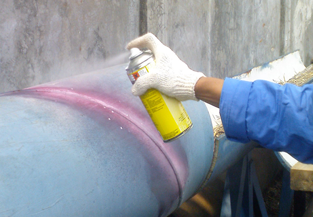

# 4. 침투 비파괴검사(PT)를 이용한 UAM 결함 검출법 조사

#### 침투 비파괴검사 (Liquid Penetraition Testing, PT)

  

###### 장점
* 거의 모든 재료에 적용 가능 &rarr; UAM에 적용이 가능하다.
* 한 번의 검사로 시험체 전체 조사 가능 &rarr; 회전률을 높여야 하는 대중교통의 성격을 가지는 UAM의 검사 시간을 단축할 수 있다.
* 복잡한 형상의 시험체 검사 가능 &rarr; 복잡한 형상의 UAM도 검사가 가능하다.
* 비교적 간단하고 숙련이 쉬움 &rarr; 인공지능을 활용한 결함 검출이 가능할 것이다.
* 미세한 결함도 검출할 수 있음
 

###### 단점
* 표면 청소 등 준비 절차 복잡 &rarr; Vertiport 내에서 1회 세척 후 검사하면 된다.
* 표면이 거칠거나 다공성 재료는 탐상할 수 없음 &rarr; 공기저항을 낮추기 위해 UAM은 매끈한 유선형의 몸체를 가진다.
* 침투제가 오염되기 쉬움 &rarr; AI를 기반으로 한 무인 플랫폼으로 운영한다면 오염 걱정을 낮출 수 있다.
* 손으로 하는 작업이 많아 검사원의 기량에 따라 시험결과가 크게 좌우됨 &rarr; 기계화 통해 균일 도포가 가능할 것이다.
* 주변환경(온도)의 영향을 많이 받음 &rarr; Vertiport 내부 검사장의 온도를 유지하면 된다.
* 결함 깊이와 내부 형상 확인 불가 &rarr; ...

 

###### 검사법
* 침지법 | 침투액에 담궈서 검사
  &rarr; 대형, 다량 검사에 적합하지 않음
* 분무법 | 스프레이로 분사
  &rarr; 침투제가 공기 중으로 잘 날아감
* 붓칠법 | 붓으로 칠함
  &rarr; 사람이 해야 함

#### 이외의 비파괴 검사법

* 와전류 비파괴검사(ET) | 시각적 이미지 획득 불가
* 초음파 비파괴검사(UT) | 시각으로 보려면 일정 처리 필요
* 자기 비파괴검사(MT), 방사선 비파괴검사(RT) | 맨눈으로 볼 수 없음, MT는 탈자 / RT는 차폐 필요

***

#### 침투 비파괴검사 결과 판독( _딥러닝을 활용한 액체침투 탐상검사 판독 방안_,  전종현(2024))
* 오픈소스 라이브러리인 YOLOv5 (Machine Vision  활용
> _국내 AI 도입 기업 현황 분석 및 시사점(소프트웨어정책연구소)_
> > 국내 기업의 AI 적용이 제한적인 이유는 초기 자금 투자에 대한 부담 때문
* 오픈소스 라이브러리를 활용하면 저비용으로 구축이 가능할 것

  &rarr; [이때, 오픈소스 라이브러리도 저작권이 있으므로 오픈소스 라이선스를 준수해야 함](https://www.fnnews.com/news/201811281705502816).

 
  
## Reference
* 이주호(2024), _UAM Propeller 결함 탐지를 위한 데이터셋 구축 및 Acoustic Anomaly Detection Model 적용 방법 연구_, 석사학위논문, 고려대학교
* 전종현(2024), _딥러닝을 활용한 액체침투 탐상검사 판독 방안_ , 석사학위논문, 부산대학교

